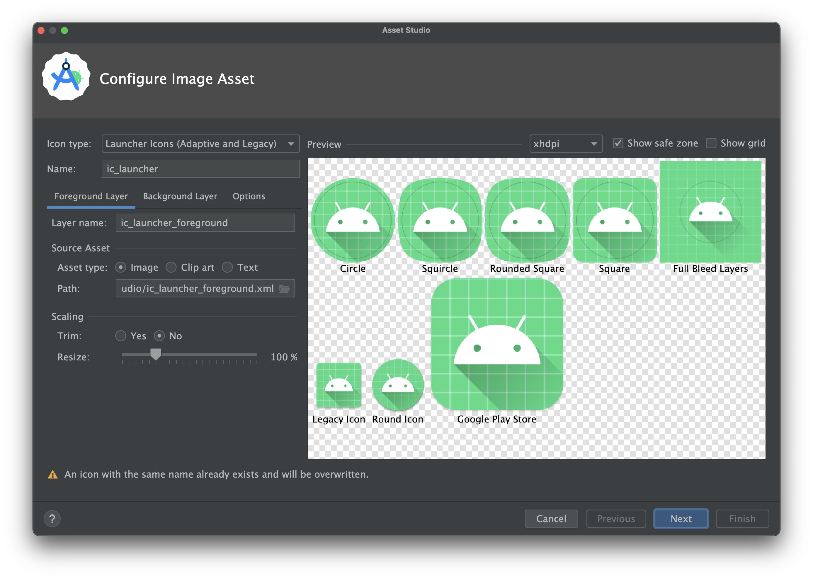

# KMP iOS IconSync Plugin

[](https://search.maven.org/artifact/io.github.ansgrb/iconsync)
[](https://www.apache.org/licenses/LICENSE-2.0)

A simple Gradle plugin that automates the generation of iOS app icons from your Android launcher icons in a Kotlin
Multiplatform project.

Say goodbye to opening Xcode just to update your app icons! This plugin uses your high-resolution Android launcher icon
as a single source of truth, creating and placing all the required iOS icons and the necessary `Contents.json` file
directly into your iOS project directory.

## Features

* **Single Source:** Uses your existing Android `ic_launcher` icon.
* **Fully Automated:** Generates all required icon sizes for iOS, from the smallest 20pt icon to the 1024pt marketing
  icon.
* **Xcode Ready:** Creates the `Contents.json` manifest file required by Xcode.
* **Effortless:** Avoids the tedious manual process of resizing and dragging icons into the asset catalog.

---

## How to Use

Follow these simple steps to get up and running.

### Step 1: Create Your Android Launcher Icon

This plugin uses the standard Android launcher icon as its source.

1. In Android Studio, open the **Project** panel.
2. Right-click on your `res` directory (usually located at `composeApp/src/androidMain/res`) and select **New** > *
   *Image Asset**.
3. In the **Asset Studio**, configure your app's icon.

   
   **Important:** For best results, use a high-resolution source image (at least **1024x1024 pixels**). The plugin needs
   this to generate the largest iOS marketing icon. The plugin will automatically find the highest quality
   `ic_launcher.webp` or `ic_launcher_foreground.webp` from your `mipmap-` directories.

### Step 2: Apply the Plugin

In your project's root `build.gradle.kts` file, add the plugin to your `plugins` block:

```kotlin
// build.gradle.kts

plugins {
	// ... other plugins
	id("io.github.ansgrb.iconsync") version "1.0.1"
}
```

### Step 3: Run the Sync Task

That's it for setup! Now, just run the `iconsync` task from your terminal.

```bash

./gradlew iconsync

```

The plugin will execute the following steps:

* Find the best-quality Android icon.
* Generate all necessary iOS icon sizes as PNG files.
* Place the generated icons and a `Contents.json` file into the `iosApp/iosApp/Assets.xcassets/AppIcon.appiconset`
  directory.

You're done! The next time you build your project in Xcode, your new icons will be there.

---

## Configuration (Optional)

The plugin works out-of-the-box for standard KMP project structures. If your directory names are different, you can
easily configure the input and output paths.

Add the following to your root `build.gradle.kts` to override the default paths:

```kotlin
// build.gradle.kts

tasks.withType<io.github.ansgrb.iconsync.IconSyncTask> {
	// Path to the directory containing your mipmap-* folders
	androidResDir.set(project.file("composeApp/src/androidMain/res"))

	// Path to the iOS AppIcon.appiconset directory
	iosAssetsDir.set(project.file("iosApp/iosApp/Assets.xcassets/AppIcon.appiconset"))
}
```

---

## License

This plugin is licensed under the Apache License, Version 2.0. You can find the full license
text [here](https://www.apache.org/licenses/LICENSE-2.0.txt).


